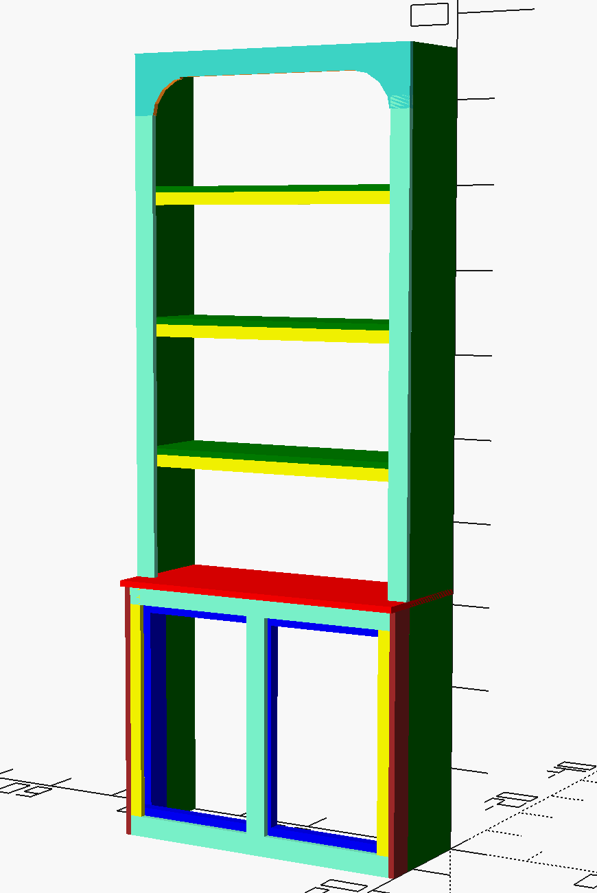

# OPENSCAD <br> LIBRARY STYLE BOOKCASE 



### Prerequisites

Openscad software<br />
https://openscad.org/


```
Give examples
```

### Installing

See openscad instructions to install openscad.<br>
make sure the 2 scad files (lumber.scad, library_bookcase_36w.scad) in this folder are in the same folder on your computer.<br>
open the file library_bookcase_36w.scad with the openscad software.


## Contributing

Feel free to contribute new code examples to this project

## Versioning

## Authors

* **Arnold Peter Ruymgaart** - [Github](https://github.com/aruymgaart)

## License

Unless otherwise noted, all files/projects in this repository are licensed under the craetive commons non-commercial license :
<br> 
This work is licensed under a creative commons license: <br> 
Attribution-NonCommercial 4.0 International (CC BY-NC 4.0)  <br> 
You are free to: <br> 
Share - copy and redistribute the material in any medium or format
Adapt - remix, transform, and build upon the material 
Under the following terms: <br>
Attribution - You must give appropriate credit, provide a link to the license, 
and indicate if changes were made. You may do so in any reasonable manner, 
but not in any way that suggests the licensor endorses you or your use.
<br>
NonCommercial - You may not use the material for commercial purposes. 
<br>
https://creativecommons.org/licenses/by-nc/4.0/legalcode
<br>

see the [LICENSE.md](LICENSE.md) file for details


